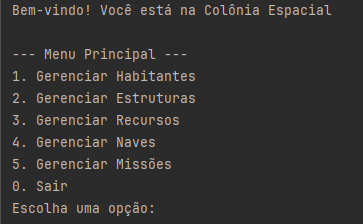
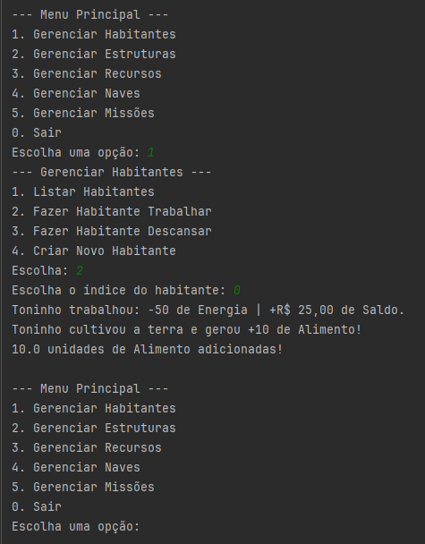

Desenvolvido por:
Nicolas Massuda
Vitor Alencar


# Simulação Colônia Espacial

Aplicação desenvolvida em Java para simular a gestão completa de uma colônia espacial via terminal. O sistema permite controlar habitantes, construir estruturas, administrar recursos, gerir uma frota de naves e executar missões espaciais de exploração e pesquisa.

---

## Sobre a Aplicação

A aplicação simula o ecossistema de uma colônia fora da Terra. Cada escolha de gerenciamento afeta o progresso da colônia:

* **Habitantes**: Trabalham para gerar recursos e saldo financeiro, gastando energia no processo. Precisam descansar para recuperar sua energia.


* **Estruturas**: Essenciais para o funcionamento da base espacial. A construção de novas estruturas exige o consumo de recursos adquiridos.


* **Recursos**: Materiais que sustentam as atividades da colônia.


* **Naves**: Meios de transporte espacial com consumo e estado de combustível gerenciáveis.


* **Missões**: Expedições espaciais planejadas que demandam tripulação e nave, concedendo recompensas aos participantes quando concluídas.


---

##  Pilares da Programação Orientação a Objetos (POO) Utilizados

O projeto explora os quatro pilares fundamentais da Programação Orientada a Objetos:

### 1. Abstração

Omite detalhes desnecessários e foca nos atributos e comportamentos essenciais.

* **Exemplo**: A classe `Habitantes` abstrai características comuns como `nome`, `idade`, `saude`, `energia` e `saldo`, definindo a regra de que todo habitante possui uma forma de `trabalhar()` e `descansar()`.


* **Classes Abstratas**: `Habitantes`, `Estruturas`, `Missoes`, `Naves` e `Recursos` servem como modelos abstratos e não podem ser instanciadas diretamente.


### 2. Encapsulamento

Proteção dos dados internos dos objetos restringindo o acesso direto aos seus atributos através do modificador `private`, garantindo segurança por meio de métodos seletores (**getters** e **setters**).

* **Exemplo**: A alteração da saúde ou energia de um habitante não ocorre por atribuição direta, mas via métodos como `descansar()` e `sofrerDano()`, que validam e garantem que os valores permaneçam dentro dos limites (0 a 100).


### 3. Herança

Reaproveitamento de código e criação de hierarquias onde subclasses herdam atributos e métodos de uma superclasse base.

* **Exemplo**: `Agricultor`, `Cientista`, `Engenheiro` e `Medico` estendem `Habitantes`, herdando toda a lógica de saúde, energia e saldo, adicionando apenas especializações próprias de cada profissão.


### 4. Polimorfismo

Capacidade de objetos de diferentes classes derivadas responderem à mesma chamada de método de maneiras diferentes (sobrescrita / `@Override`).

* **Exemplo**: O método abstrato `trabalhar()` é declarado na superclasse `Habitantes`. Quando invocado no loop principal, cada classe filha executa sua própria implementação:


* `Agricultor.trabalhar()` gera alimento.


* `Cientista.trabalhar()` gera energia.


* `Engenheiro.trabalhar()` gera minério.


* `Medico.trabalhar()` gera água.


---

##  Outros Fundamentos e Conceitos Aplicados

* **Enums (Enumerações)**: Utilização do enum `Combustivel` (`CHEIO`, `RESERVA`, `VAZIO`) para representar de forma segura e fortemente tipada os estados do tanque das naves.


* **Polimorfismo com Coleções (Listas de Interface/Superclasse)**: Uso de `List<Habitantes>`, `List<Estruturas>`, `List<Recursos>`, `List<Naves>` e  `List<Missoes>` permitindo armazenar diferentes subclasses em uma única coleção.


* **Verificação de Tipos Dinâmica (`instanceof`)**: Checagem do tipo concreto do objeto em tempo de execução para evitar duplicidade na criação de estruturas.
* **Estruturas de Controle e Repetição**: Controle do fluxo do simulador através do laço `while` e seleção de opções com `switch-case` no terminal.
* **Tratamento de Exceções / Entrada de Dados**: Uso de conversão de tipos para validação de entradas do usuário via console (`Integer.parseInt`).

---

##  Regras de Negócio do Simulador

### Habitantes e Trabalho

* **Trabalhar**: Consome **50 de energia** do habitante e concede **R$ 25,00 de saldo**. Além disso, adiciona **10 unidades de recurso** ao estoque de recuros de acordo com a profissão:


* Agricultor: +10 Alimento


* Cientista: +10 Energia


* Engenheiro: +10 Minério


* Médico: +10 Água


* **Descansar**: Recupera a energia do habitante até o limite máximo de **100**.


### Construção de Estruturas

* A construção de qualquer nova estrutura requer a disponibilidade e consumo dos seguintes recursos do estoque global:


* **50 de Alimento**

* **50 de Energia**

* **10 de Minério**


* O sistema possui verificação para impedir a criação duplicada de uma mesma classe de estrutura no mapa.

### Missões e Recompensas

* Missões podem ser iniciadas, executadas e finalizadas.


* Ao finalizar uma missão com sucesso, todos os habitantes atribuídos à tripulação recebem um prêmio de **R$ 300,00 de saldo**.


---

## Estrutura do Projeto

```text
src/
│
├── Main.java                 # Ponto de entrada da aplicação, fluxo principal e menus
│
├── estruturas/               # Estruturas da colônia
│   ├── Estruturas.java       # Classe abstrata base
│   ├── Fazenda.java
│   ├── Habitacao.java
│   ├── Hospital.java
│   ├── Laboratorio.java
│   ├── Mina.java
│   └── UsinaEnergia.java
│
├── habitantes/               # População e profissões
│   ├── Habitantes.java       # Classe abstrata base
│   ├── Agricultor.java
│   ├── Cientista.java
│   ├── Engenheiro.java
│   └── Medico.java
│
├── missoes/                  # Missões espaciais
│   ├── Missoes.java          # Classe abstrata base
│   ├── MissaoExploracao.java
│   ├── MissaoMineracao.java
│   ├── MissaoPesquisa.java
│   └── MissaoResgate.java
│
├── naves/                    # Naves
│   ├── Naves.java            # Classe abstrata base
│   ├── Combustivel.java      # Enum de status de combustível
│   ├── Cargueiro.java
│   ├── NaveExploracao.java
│   └── NaveTransporte.java
│
└── recursos/                 # Gerenciamento de recursos
    ├── Recursos.java         # Classe abstrata base
    ├── Agua.java
    ├── Alimento.java
    ├── Energia.java
    ├── Minerio.java
    └── Oxigenio.java

```

---

##  Como Usar

### Pré-requisitos

* **Java Development Kit (JDK)**: Versão 21 ou superior (compatível com os recursos `java.lang.IO.*` e declaração simplificada da `main` como `void main(){}`).
* **IntelliJ**


### Passo a Passo de Execução

1. Abra o terminal no diretório raiz do projeto onde estão as pastas dos pacotes e o arquivo `Main.java`.
2. Compile todo o código-fonte:
```bash
javac estruturas/*.java habitantes/*.java missoes/*.java naves/*.java recursos/*.java Main.java

```


3. Inicie o simulador:
```bash
java Main

```


4. Navegue pelo menu inserindo o número correspondente à opção desejada:
* **Menu Principal**: Escolha a categoria de gerenciamento (Habitantes, Estruturas, Recursos, Naves ou Missões).
* **Gerenciar Habitantes**: Coloque habitantes para trabalhar para gerar recursos/saldo ou coloque-os para descansar quando estiverem sem energia.


* **Gerenciar Estruturas**: Verifique construções ativas, produza ou construa novas instalações acumulando os recursos necessários.


* **Gerenciar Missões**: Monte a tripulação das missões e finalize-as para recompensar a equipe.

### Execução:


*===========================================*

